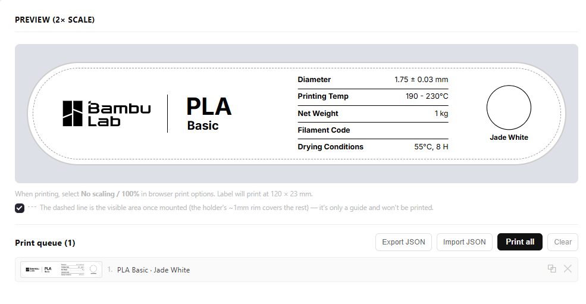
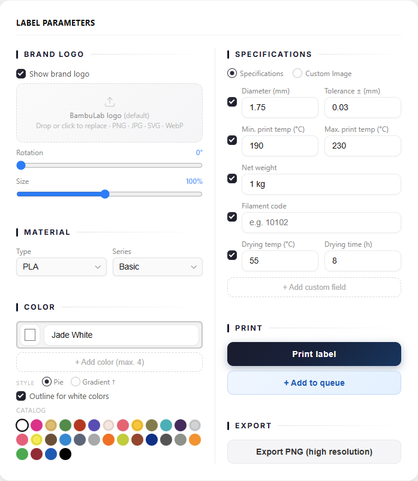

#  SpoolCard

A Bambu Lab–style filament spool label generator (120 × 23 mm, true scale). A fully
static app — HTML + CSS + vanilla JS, no build step, no server dependencies.

### 🔗 [**Open SpoolCard and start making labels**](https://javierconfoie.github.io/SpoolCard/)

No install, no sign-up — it runs entirely in your browser.





## Structure

```
index.html               Entry point
css/style.css             Styles
js/app.js                 Application logic
js/colors-data.js         Editable data: material presets, series, color catalog
assets/                   Logos and vendored html2canvas library
reference/                Photo of a real Bambu Lab label, used as a design reference
```

## Running locally

Open `index.html` directly in your browser, or serve the folder with any static
server:

```
npx serve .
```

## Publishing with GitHub Pages

1. Push this repository to GitHub.
2. In **Settings → Pages**, select the `main` branch and the `/ (root)` folder.
3. The app will be published at `https://<user>.github.io/<repo>/` — no domain or
   hosting of your own needed.

## Features

- Customizable brand logo (Bambu Lab by default, or your own image).
- Material type and series with autocomplete, plus Bambu Lab's official color
  catalog (editable in `js/colors-data.js`, no code changes needed to add a color).
- Up to 4 colors per label (pie or gradient style).
- Configurable specs (diameter, print temperature, weight, filament code, drying
  conditions) or a fully custom center image.
- Print queue to generate several labels at once, each individually editable.
- Direct printing or high-resolution PNG export (300 DPI, via `html2canvas`).
- Light/dark mode.

## License

Copyright (C) 2026 [javierconfoie](https://github.com/javierconfoie)

Licensed under the **GNU Affero General Public License v3.0** (AGPL-3.0) — see
[LICENSE](LICENSE). In short: you're free to use, modify, and redistribute this
project, including running your own hosted copy — but if you do, you must keep it
open source under the same license and credit the original project, even for a
modified version served over a network (not just distributed as files). See the
`LICENSE` file for the full terms.

**Inter** (the UI font) is separately licensed under the SIL Open Font License and
served from Google Fonts.

## Trademarks

"Bambu Lab" and the Bambu Lab logo are trademarks of their respective owner and are
used here only to describe and replicate the Bambu Lab label format this tool
generates. SpoolCard is an independent, community-made project and is not
affiliated with, endorsed by, or sponsored by Bambu Lab. All trademarks and logos
belong to their respective owners.
